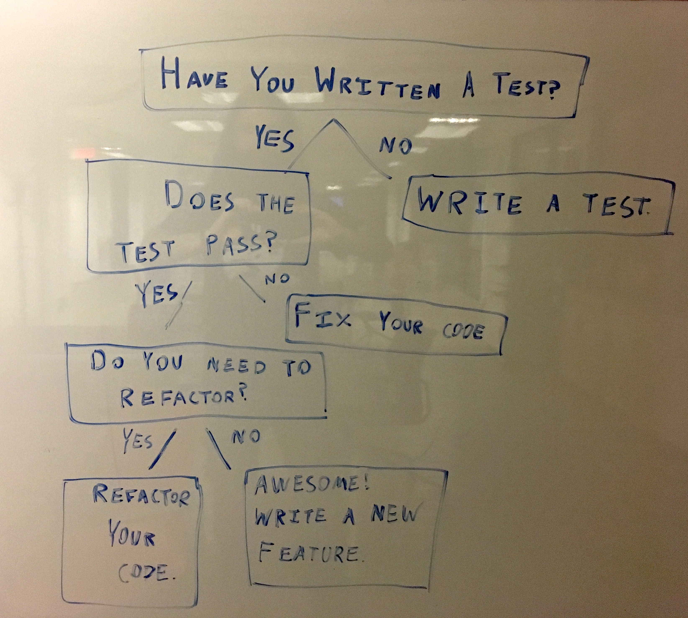

# Pair Programming Bot Lite

Your task will to be to create a pair-programming 'bot' to be your trusty, reliable companion. This bot will ask you 'helpful' questions to help you decide what you should be doing. It will function as your *navigator*, while you will *drive*, or code. 

This pair-programming bot is very big on telling its users (programmers) to build tests for the code they have written. We'll cover testing later on in the course, but for now we'll focus on implementing this bot using the concepts of control flow.

## Specifications

Implement the flow chart below with conditionals.


Use the `prompt()` function to capture user input, and the `alert()` function to display messages to the user.

## Getting Started

### Set Up

1. Clone down this repository. Do not worry about forking this repository since this exercise will not be a submitted assignment.
2. Create `index.html` and a `script.js` file.
3. Add HTML boilerplate to `index.html` and load your `script.js` via a `<script></script>` tag.
   > Don't forget to include the path to `script.js` as the value of the `src` attribute of the `<script>` tag.
4. Add `console.log('Hello World')` to your `script.js` file, to ensure that your JavaScript code is being loaded.

### Breaking Down the Flow Chart

Each box represents a message to the user. The messages that are in the form of questions will expect an answer, or some type of user input that can be captured with `prompt()`. The messages which instruct you or the user to do something don't need user input and can be conveyed with the `alert()` function.

You can store the user's answers in a variable...

```js
var firstAnswer = prompt("What is your favorite type candy?")

// Checking the value with a console.log()
console.log(firstAnswer)
```

You can then check the variable for certain values.

```js
if (firstAnswer === 'potato') {
  alert('Fairly sure that potato is not a candy.')
}
```
 
## Bonus

1. Have your program handle inputs like `'yes'`, `'Y'`, `'yEs'`, `'YeS'`, `'nO'`, `'NO'` and so on.

2. Start over from the beginning if you are instructing the user to do something, unless the message is the final message, `'Awesome! Write a new feature.'`, since this would result in an infinite loop.
